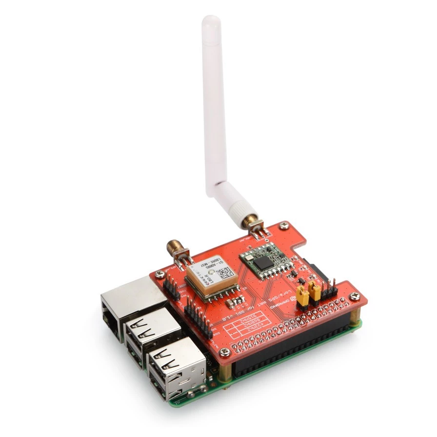
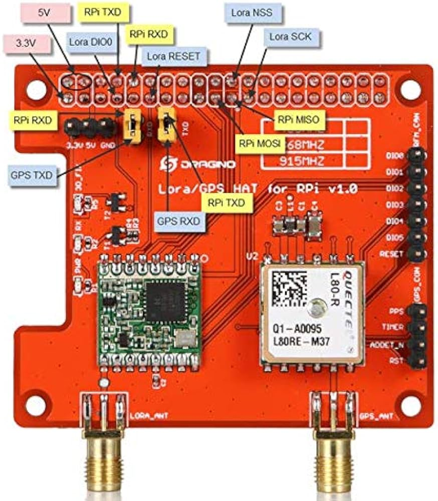

```
━━━━━━━━━━━━━━━━━━━━━━━━━━━━━━━━━━━━━━━━━━━━━━━━━━━━
              LoRa COMMUNICATION LAB
   MODUL 06 — LoRa dari Linux (Python, tanpa library)

   Raspberry Pi + Dragino LoRa GPS HAT · Intermediate
━━━━━━━━━━━━━━━━━━━━━━━━━━━━━━━━━━━━━━━━━━━━━━━━━━━━
```

## 1 · Pendahuluan

Modul 06 dirancang untuk dua pertemuan (2 × 50 menit) pada tingkat menengah. Misinya memindahkan tautan LoRa Modul 01 ke platform yang sama sekali berbeda — Raspberry Pi dengan Python di atas Linux — dan melakukannya **tanpa satu pun library LoRa**. Percobaan memakai dua Raspberry Pi bershield Dragino LoRa GPS HAT v1.4, diamati langsung pada terminal masing-masing.

Lima modul sebelumnya selalu diawali baris yang sama: `LoRa.begin(FREQUENCY)`. Satu baris itu menyembunyikan reset perangkat keras, verifikasi identitas chip, perhitungan pembagi frekuensi, penyiapan alamat FIFO, dan perpindahan mode operasi — semuanya dikerjakan library sandeepmistry di belakang layar. Selama radio bekerja, tidak ada alasan membongkarnya. Begitu radio **tidak** bekerja, praktikan yang tidak pernah melihat isinya tidak punya tempat untuk mulai mencari. Modul ini membongkarnya: setiap fungsi di `src/sender.py` dan `src/receiver.py` adalah tulisan atau bacaan langsung ke register SX1276 lewat SPI, dan nama fungsinya sengaja dibuat menyerupai API Arduino agar kedua sisi dapat dibandingkan baris per baris.

Prasyaratnya adalah M01 — parameter radio, RSSI, SNR, dan hitungan loss dari nomor urut semuanya dipakai lagi di sini tanpa perubahan. Yang dibangun di modul ini adalah pemahaman lapisan di bawah library: peta register, tata cara transaksi SPI, perhitungan `frf`, penanganan IRQ flag, serta alasan mengapa nilai mentah register RSSI harus dikoreksi sebelum berarti dBm. Kemampuan tersebut dipakai lagi di M07, tempat Raspberry Pi menjadi master yang menjadwalkan slave Arduino.

**Peta modul LoRa**

| Modul | Fokus (yang ditumpuk di atas modul sebelumnya) |
|---|---|
| 01 | Tautan satu arah terbentuk; RSSI dan SNR terbaca |
| 02 | Penerimaan lewat interrupt — `loop()` tidak lagi menunggu |
| 03 | Dua arah bergantian di atas radio half-duplex |
| 04 | Setiap pengiriman diketahui hasilnya: ACK, timeout, statistik |
| 05 | Banyak node — hak bicara dijadwalkan agar tidak bertabrakan |
| **06 (ini)** | **Platform berganti ke Linux; library dilepas, register dipegang langsung** |
| 07 | Gateway Linux menjadwalkan node mikrokontroler |

**Kontrak data lab ini.** Payload tetap `Hello LoRa #n` persis seperti M01, dan parameter radionya tetap SF7 / BW 125 kHz / CR 4/5 / 17 dBm. Kesamaan itu bukan kemalasan: karena payload dan parameter identik, **sender Raspberry Pi modul ini dapat diuji langsung terhadap receiver Arduino Modul 01** dan sebaliknya. Uji silang itulah yang membuktikan bahwa yang berbicara adalah radionya, bukan librarynya — dan itu menjadi EXP-03.

## 2 · Capaian Pembelajaran

Setelah menyelesaikan modul ini, praktikan mampu:

1. Menjelaskan urutan langkah yang dikerjakan `LoRa.begin()` dengan menunjuk register yang ditulis pada tiap langkah di `loraBegin()`.
2. Membaca dan menulis register SX1276 lewat SPI, serta menjelaskan peran bit ke-7 alamat dalam membedakan operasi baca dan tulis.
3. Menghitung nilai `frf` dari frekuensi yang diinginkan, dan memverifikasi hasilnya dengan membaca kembali ketiga register `REG_FRF_*`.
4. Membuktikan interoperabilitas SX1276 lintas platform dengan menjalankan tautan silang Raspberry Pi ↔ Arduino, lalu menjelaskan mengapa keduanya saling mengerti.
5. Menjelaskan mengapa nilai mentah `REG_PKT_RSSI_VALUE` harus dikoreksi dengan offset yang berbeda untuk band di bawah dan di atas 868 MHz.

**Kriteria keberhasilan**

- ☐ `Init LoRa ... OK` muncul di kedua Raspberry Pi — artinya `REG_VERSION` terbaca `0x12`.
- ☐ Receiver mencetak isi paket beserta RSSI dan SNR, dengan nomor urut naik satu per satu.
- ☐ Tautan silang Pi → Arduino **dan** Arduino → Pi keduanya berhasil tanpa mengubah satu baris pun di kedua sisi.
- ☐ Nilai `frf` hasil hitungan tangan cocok dengan isi register yang dibaca kembali dari chip.
- ☐ Perubahan satu parameter di satu sisi menghentikan tautan, dan penyebabnya dapat ditunjuk pada register mana yang berbeda.

## 3 · Dasar Teori (secukupnya)

| Istilah | Definisi kerja di lab ini |
|---|---|
| Register | Satu byte penyimpanan di dalam SX1276 yang menentukan atau melaporkan satu aspek keadaan radio. Alamatnya 7 bit. |
| Transaksi SPI | Dua byte: byte pertama alamat, byte kedua data. Bit ke-7 alamat bernilai 1 berarti **tulis**, 0 berarti **baca**. |
| NSS (chip select) | Jalur yang ditarik LOW selama transaksi berlangsung. Pada HAT ini NSS adalah GPIO 25 biasa, bukan CE0 bawaan SPI, sehingga harus digerakkan sendiri oleh program. |
| FIFO | Penyangga 256 byte di dalam chip, dipakai bergantian untuk TX dan RX. Pointer `REG_FIFO_ADDR_PTR` menentukan posisi baca/tulis berikutnya. |
| Mode operasi | Isi `REG_OP_MODE`: SLEEP, STDBY, TX, RXCONTINUOUS. Sebagian register hanya boleh diubah saat SLEEP atau STDBY. |
| `frf` | Bilangan 20-bit pembagi frekuensi: `frf = f / 32 MHz × 2¹⁹`, disimpan pada tiga register MSB/MID/LSB. |
| IRQ flag | Bit penanda kejadian di `REG_IRQ_FLAGS` — TX selesai, RX selesai, CRC gagal. Ditulis 1 untuk **membersihkan**, bukan 0. |
| Offset RSSI | Nilai register RSSI adalah angka mentah; dBm sebenarnya = nilai − 164 untuk band rendah (433 MHz), atau − 157 untuk band tinggi (868/915 MHz). |

**Mengapa NSS dikendalikan manual.** SPI perangkat keras Raspberry Pi menyediakan dua jalur chip select bawaan, CE0 dan CE1. Dragino tidak memakainya: pada HAT ini NSS SX1276 tersambung ke GPIO 25. Akibatnya kode membuka SPI dengan `_spi.open(0, 0)` — bus 0, device 0 — tetapi CE0 yang ikut aktif itu tidak tersambung ke apa pun, dan setiap transaksi harus diapit `GPIO.output(NSS_PIN, LOW)` … `HIGH` sendiri. Inilah yang dikerjakan `_read_reg()` dan `_write_reg()`, dan inilah satu-satunya perbedaan mendasar terhadap driver Arduino yang memakai `digitalWrite(NSS, LOW)` untuk alasan yang sama persis.

**Mengapa identitas chip diperiksa lebih dahulu.** SX1276 hingga SX1279 selalu menjawab `0x12` pada `REG_VERSION`. Pembacaan itu adalah uji ujung-ke-ujung termurah yang ada: bila jawabannya `0x00` atau `0xFF`, jalur SPI-nya yang bermasalah — HAT tidak duduk sempurna, SPI belum diaktifkan di `raspi-config`, atau NSS salah pin. Radio bahkan belum masuk hitungan. `LoRa.begin()` di Arduino melakukan pemeriksaan yang sama; hanya saja hasilnya diringkas menjadi `true` atau `false`.

**Sekuens yang diamati**

```
   Sender (Pi)                                    Receiver (Pi)
       |                                                |
  loraBegin()                                     loraBegin()
  reset HW, baca REG_VERSION -> 0x12              (sama)
  set frf, FIFO base, STDBY                       (sama)
       |                                                |
       |                                          startRx()
       |                                          REG_OP_MODE = RXCONTINUOUS
  beginPacket()                                         |
  STDBY, FIFO_ADDR_PTR=0, PAYLOAD_LENGTH=0        polling REG_IRQ_FLAGS
  loraPrint("Hello LoRa #0")                            |
  tulis tiap byte ke REG_FIFO                           |
  endPacket()                                           |
  REG_OP_MODE = TX  ~~~~~~ udara ~~~~~~>          RX_DONE menyala
  tunggu TX_DONE, lalu bersihkan flagnya          FIFO_ADDR_PTR = RX_CURRENT_ADDR
       |                                          baca RX_NB_BYTES byte dari FIFO
       |                                          baca RSSI & SNR paket terakhir
  sleep(2 s), ulangi                              cetak, kembali ke STDBY
```

## 4 · Topologi

```
              BOARD #1                          BOARD #2
      +----------------------+          +----------------------+
      |    Raspberry Pi      |          |    Raspberry Pi      |
      |  + LoRa GPS HAT v1.4 |          |  + LoRa GPS HAT v1.4 |
      |       SENDER         |          |      RECEIVER        |
      |   src/sender.py      |          |   src/receiver.py    |
      |                      |          |                      |
      |  "Hello LoRa #n"     | =======> |  cetak isi + RSSI +  |
      |  tiap 2 detik        |  433 MHz |  SNR tiap paket      |
      +----------------------+          +----------------------+

  Varian silang untuk EXP-03 — satu sisi diganti perangkat Modul 01:

      Raspberry Pi (sender.py)  =====>  Arduino Uno (M01 receiver)
      Arduino Uno (M01 sender)  =====>  Raspberry Pi (receiver.py)
```

| Node | Program | Peran | Antarmuka pengamatan |
|---|---|---|---|
| Pi #1 | `src/sender.py` | Mengirim `Hello LoRa #n` tiap 2 detik | terminal / SSH |
| Pi #2 | `src/receiver.py` | Menerima, mencetak isi + RSSI + SNR | terminal / SSH |

Bila hanya tersedia satu Raspberry Pi, seluruh modul tetap dapat dikerjakan dengan memasangkannya pada satu Arduino Uno bershield Dragino v1.2 yang menjalankan firmware Modul 01 — persis konfigurasi EXP-03. Yang hilang hanyalah kesempatan membandingkan dua terminal Python berdampingan.

## 5 · Alat yang Digunakan

Modul ini dijalankan di atas Raspberry Pi dengan Dragino LoRa GPS HAT v1.4 (SX1276), memakai Python 3 dengan `spidev` dan `RPi.GPIO`. Tidak ada PlatformIO di modul ini — tidak ada yang dikompilasi.

| No | Peralatan | Spesifikasi | Jumlah |
|---|---|---|---|
| 1 | Raspberry Pi | 2 / 3 / 4 (Pi 5 lihat catatan) | 2 |
| 2 | Dragino LoRa GPS HAT | v1.4, SX1276, 433 MHz | 2 |
| 3 | Antena 433 MHz | konektor SMA | 2 |
| 4 | Catu daya Pi | sesuai model | 2 |
| 5 | Kartu microSD | Raspberry Pi OS, SPI aktif | 2 |



> **Jangan menyalakan HAT tanpa antena.** Sama seperti shield Arduino: daya pancar yang tidak menemukan beban dipantulkan kembali ke penguat SX1276 dan dapat merusaknya permanen.

**Pemetaan pin HAT → Raspberry Pi**



| LoRa GPS HAT | WiringPi | BCM GPIO | Padanan di shield Arduino | Keterangan |
|---|---|---|---|---|
| LoRa_NSS | GPIO6 | **25** | D10 | Chip select — digerakkan manual |
| RESET | GPIO0 | **17** | D9 | Reset perangkat keras SX1276 |
| DIO0 | GPIO7 | **4** | D2 | IRQ TX/RX done — tidak dipakai modul ini |
| SCK | GPIO14 | **11** | D13 | SPI0 clock |
| LoRa_MOSI | GPIO12 | **10** | D11 | SPI0 MOSI |
| LoRa_MISO | GPIO13 | **9** | D12 | SPI0 MISO |
| DIO1 | GPIO4 | 23 | D6 | tidak dipakai |
| DIO2 | GPIO5 | 24 | D7 | tidak dipakai |
| GPS_RX | GPIO15/TX | 14 | — | UART ke modul GPS onboard |
| GPS_TX | GPIO16/RX | 15 | — | UART dari modul GPS onboard |
| 1PPS | GPIO1 | 18 | — | pulsa 1 detik dari GPS |

Kolom **WiringPi** adalah penomoran yang dipakai dokumentasi resmi Dragino; kolom **BCM** adalah yang dipakai kode Python — seluruh skrip memanggil `GPIO.setmode(GPIO.BCM)`. Kedua kolom menunjuk pin fisik yang sama, dan tertukarnya keduanya adalah penyebab kegagalan yang paling sering terjadi di modul ini.

Bagian GPS pada HAT tidak dipakai sama sekali di seri ini; jalurnya dicantumkan agar praktikan tahu pin mana yang sudah terpakai bila hendak menambahkan perangkat lain.

**Struktur proyek**

```
week06_rpi_lora_python/
├── README.md
├── requirements.txt        ← spidev + RPi.GPIO (atau rpi-lgpio untuk Pi 5)
└── src/
    ├── sender.py           ← kirim "Hello LoRa #n" tiap 2 detik
    └── receiver.py         ← terima, cetak isi + RSSI + SNR
```

Kedua berkas **berdiri sendiri**: masing-masing membawa salinan drivernya. Pemisahan itu disengaja — satu berkas dapat disalin ke Pi mana pun dan langsung berjalan, dan praktikan dapat membongkar satu sisi tanpa takut merusak sisi lain. Konsekuensinya, `sender.py` hanya memuat register yang dibutuhkan TX, sedangkan `receiver.py` memuat lebih banyak: RSSI, SNR, dan pointer FIFO RX. Membandingkan kedua daftar register itu sendiri sudah memberi tahu apa yang khusus diperlukan penerimaan.

**Persiapan Raspberry Pi**

```bash
sudo raspi-config          # Interface Options > SPI > Yes
sudo reboot
ls /dev/spi*               # harus muncul: /dev/spidev0.0  /dev/spidev0.1

pip3 install -r week06_rpi_lora_python/requirements.txt
```

> **Raspberry Pi 5.** Chip GPIO baru (RP1) tidak didukung `RPi.GPIO`. Pasang `rpi-lgpio` sebagai gantinya — paket itu menyediakan modul dengan nama yang sama, sehingga `import RPi.GPIO as GPIO` di kode tetap berjalan apa adanya. **Jangan memasang keduanya sekaligus**; keduanya mendaftarkan nama modul yang sama dan akan saling menimpa. Rinciannya ada di `requirements.txt`.

**Menjalankan** — penerima lebih dahulu, agar paket pertama pengirim tidak terbuang.

```bash
python3 week06_rpi_lora_python/src/receiver.py     # di Pi #2
python3 week06_rpi_lora_python/src/sender.py       # di Pi #1
```

Hentikan dengan `Ctrl-C`. Kedua skrip menutup SPI dan mengembalikan GPIO ke keadaan semula pada blok `finally`, sehingga penghentian di tengah jalan tidak meninggalkan pin dalam keadaan menggantung.

**Pre-flight checklist**

- ☐ Antena terpasang pada kedua HAT.
- ☐ SPI aktif di kedua Pi — `ls /dev/spi*` menampilkan `spidev0.0`.
- ☐ `spidev` dan `RPi.GPIO` (atau `rpi-lgpio` pada Pi 5) sudah terpasang.
- ☐ Nilai `FREQUENCY` pada kedua berkas **sama persis** dan sesuai band HAT yang dipakai.
- ☐ Bila mengerjakan EXP-03, satu Arduino Uno Modul 01 siap beserta Serial Monitor 9600 baud.

## 6 · Percobaan

### EXP-01 — Chip Menjawab Namanya

Jalankan `receiver.py`, dan amati baris pertama sebelum apa pun mengudara.

**Expected output**

```
=== LoRa RECEIVER ===
Init LoRa ... OK
Frekuensi : 433 MHz
SF=7, BW=125kHz, CR=4/5, Power=17dBm
Menunggu data ...
```

**Data capture**

| Parameter | Hasil |
|---|---|
| Pesan init pada Pi sender | |
| Pesan init pada Pi receiver | |
| Isi `/dev/spi*` yang terdaftar | |
| Model Raspberry Pi & versi Python | |
| Library GPIO yang dipakai (`RPi.GPIO` / `rpi-lgpio`) | |

**Buka abstraksinya** — kata `OK` pada baris kedua sepenuhnya bergantung pada satu perbandingan di dalam `loraBegin()`: `version != 0x12`. Sisipkan `print(hex(version))` tepat sebelum baris itu, jalankan ulang, dan catat nilainya. Kemudian **lepas HAT dari header** (Pi dimatikan lebih dahulu), pasang kembali dengan longgar sengaja, dan jalankan lagi. Bandingkan nilai yang tercetak pada kedua keadaan, lalu jelaskan mengapa `0x00` dan `0xFF` adalah dua gejala kegagalan yang berbeda.

> **CHECKPOINT** — Kedua Pi mencetak `OK`. Bila muncul `GAGAL!`, jangan menyentuh parameter radio sama sekali: yang gagal adalah lapisan SPI, bukan lapisan radio. Periksa berurutan — SPI aktif di `raspi-config`, `/dev/spidev0.0` ada, HAT duduk penuh di 40 pin, lalu barulah kabel.

### EXP-02 — Aliran Data Satu Arah

Jalankan receiver, lalu sender. Biarkan berjalan dua menit sambil mengamati nomor urut di kedua terminal.

**Expected output — receiver**

```
[RX #1] "Hello LoRa #0" | RSSI=-48 dBm | SNR=9.5 dB
[RX #2] "Hello LoRa #1" | RSSI=-47 dBm | SNR=9.8 dB
[RX #3] "Hello LoRa #2" | RSSI=-49 dBm | SNR=9.3 dB
```

**Data capture**

| Parameter | Hasil |
|---|---|
| Nomor urut terakhir di sender | |
| Nomor urut terakhir di receiver (`Hello LoRa #`) | |
| Nomor `[RX #n]` terakhir di receiver | |
| Paket hilang (selisih nomor urut) | |
| RSSI rata-rata (dBm) | |
| SNR rata-rata (dB) | |

Perhatikan bahwa receiver mencetak **dua** penghitung yang berbeda: `[RX #n]` adalah hitungan lokal paket yang berhasil diterima, sedangkan angka di dalam `Hello LoRa #n` berasal dari sender. Selisih keduanya adalah jumlah paket yang hilang — dan itulah alasan nomor urut ditaruh di dalam payload sejak M01.

> **CHECKPOINT** — Nomor urut yang diterima naik satu per satu tanpa lompatan pada jarak dekat. Bila `[RX #n]` naik tetapi isi payload berulang atau teracak, yang bermasalah adalah pembacaan FIFO, bukan tautan radionya: periksa apakah `initRxSequence()` benar-benar dipanggil sebelum byte dibaca.

### EXP-03 — Uji Silang Platform

Inilah percobaan inti modul ini. Parameter dan payload Modul 06 sengaja dibuat identik dengan Modul 01, sehingga kedua platform dapat dipasangkan silang tanpa mengubah kode mana pun.

| Uji | Pengirim | Penerima | Hasil yang teramati |
|---|---|---|---|
| 03-a | Pi `sender.py` | Pi `receiver.py` | |
| 03-b | Pi `sender.py` | Arduino M01 `receiver` (Serial Monitor 9600) | |
| 03-c | Arduino M01 `sender` | Pi `receiver.py` | |
| 03-d | Arduino M01 `sender` | Arduino M01 `receiver` | |

Catat RSSI dan SNR pada tiap baris. Perhatikan bahwa uji 03-b dan 03-c melibatkan dua penulis kode yang sama sekali berbeda — driver Python di berkas ini dan library sandeepmistry di Arduino — yang tidak pernah saling melihat kode satu sama lain.

> **CHECKPOINT** — Keempat kombinasi berhasil. Bila hanya 03-a dan 03-d yang berhasil sedangkan kombinasi silang gagal, penyebabnya hampir pasti parameter yang tidak seragam: periksa `FREQUENCY` di berkas Python **dan** `FREQUENCY` di source Arduino, lalu SF, BW, dan CR pada keduanya. Kegagalan silang hampir tidak pernah disebabkan perbedaan platform.

**Mengapa uji silang ini berhasil.** Yang berbicara di udara bukan Python dan bukan C++, melainkan SX1276. Selama kedua chip disetel ke frekuensi, spreading factor, bandwidth, dan mode header yang sama, keduanya menghasilkan bentuk gelombang yang identik — dan bentuk gelombang itu tidak membawa jejak apa pun tentang bahasa atau prosesor yang menyusunnya. Library hanyalah cara yang lebih nyaman untuk menulis register yang sama.

### EXP-04 — Membaca Kembali Apa yang Ditulis

Semua register yang ditulis dapat dibaca kembali. Verifikasi tiga di antaranya dengan menyisipkan potongan berikut setelah blok `setTxPower(17)` di `receiver.py`:

```python
print("REG_OP_MODE      =", hex(_read_reg(REG_OP_MODE)))
print("REG_FRF (MSB/MID/LSB) =",
      hex(_read_reg(REG_FRF_MSB)), hex(_read_reg(REG_FRF_MID)), hex(_read_reg(REG_FRF_LSB)))
print("REG_MODEM_CONFIG_1/2  =",
      hex(_read_reg(REG_MODEM_CONFIG_1)), hex(_read_reg(REG_MODEM_CONFIG_2)))
```

**Data capture**

| Register | Nilai terbaca | Nilai yang diharapkan (hitung sendiri) | Cocok? |
|---|---|---|---|
| `REG_OP_MODE` | | | |
| `REG_FRF_MSB` | | | |
| `REG_FRF_MID` | | | |
| `REG_FRF_LSB` | | | |
| `REG_MODEM_CONFIG_1` | | | |
| `REG_MODEM_CONFIG_2` | | | |

Hitung `frf` dengan tangan lebih dahulu: `frf = 433 000 000 / 32 000 000 × 2¹⁹`, lalu pecah hasilnya menjadi tiga byte. Untuk `REG_MODEM_CONFIG_1`, susun dari kolom-kolomnya: empat bit teratas adalah indeks bandwidth (125 kHz menempati indeks ke berapa pada `bw_table`?), tiga bit berikutnya coding rate dikurangi 4, dan bit terbawah menandai mode header. Untuk `REG_MODEM_CONFIG_2`, empat bit teratas adalah spreading factor.

> **CHECKPOINT** — Ketiga byte `frf` cocok dengan hitungan tangan, dan nibble atas `REG_MODEM_CONFIG_2` bernilai 7. Bila `frf` meleset satu-dua satuan, periksa pembulatan — kode memakai `int(round(...))`, dan pembulatan ke bawah menghasilkan pergeseran frekuensi sebesar puluhan hertz yang tidak berbahaya tetapi membuat angkanya tidak cocok.

### Catatan verifikasi

Berbeda dari Modul 01–05, **modul ini belum memiliki log referensi hasil uji perangkat**. Kode sumbernya berasal dari repositori Dragino LoRa GPS HAT yang menyatakan telah diuji dan berjalan pada Raspberry Pi 4; pengujian ulang setelah dijadikan modul lab ini belum dilakukan, dan tidak ada Raspberry Pi bershield HAT yang tersambung saat penyusunan. Angka pada seluruh tabel di atas memang disediakan kosong untuk diisi praktikan — termasuk tabel EXP-04, yang jawabannya justru dapat diperiksa sendiri lewat hitungan tangan tanpa perlu membandingkan dengan siapa pun.

## 7 · Pengukuran

**A. Jarak terhadap kualitas tautan** — sender dan receiver dipisahkan pada empat jarak, masing-masing diamati 60 detik.

| Jarak | RSSI (dBm) | SNR (dB) | Paket dikirim | Paket diterima | Loss (%) |
|---|---|---|---|---|---|
| 1 m | | | | | |
| 10 m | | | | | |
| 50 m | | | | | |
| 100 m | | | | | |

**B. Perbandingan platform pada jarak yang sama** — ulangi tiap kombinasi EXP-03 selama 60 detik pada jarak tetap 10 m.

| Kombinasi | RSSI (dBm) | SNR (dB) | Loss (%) |
|---|---|---|---|
| Pi → Pi | | | |
| Pi → Arduino | | | |
| Arduino → Pi | | | |
| Arduino → Arduino | | | |

Bila salah satu baris menyimpang jauh dari tiga lainnya, calon penyebabnya bukan platform melainkan antena, tinggi pemasangan, atau bidang logam di dekatnya — catat kondisi fisiknya bersama angkanya.

**C. Ketepatan waktu kirim** — sender memakai `time.sleep(2)`, bukan penjadwal. Catat selang antar-paket dari cap waktu penerimaan.

| Ukuran | Nilai |
|---|---|
| Selang antar-paket minimum (s) | |
| Selang antar-paket maksimum (s) | |
| Selang rata-rata (s) | |
| Simpangan terhadap 2,000 s | |

## 8 · Analisis

1. Dari tabel B, apakah kombinasi silang Pi ↔ Arduino menunjukkan RSSI atau loss yang berbeda secara berarti dibanding kombinasi sejenis? Bila ya, sebutkan penyebab fisik yang paling mungkin — dan jelaskan mengapa perbedaan bahasa pemrograman **bukan** salah satunya.
2. Tabel C hampir pasti menunjukkan selang yang lebih besar dari 2,000 detik. Jelaskan sumbernya dengan menyebut dua hal: apa yang dikerjakan `endPacket()` selama menunggu, dan apa yang dijamin — serta tidak dijamin — oleh `time.sleep()` pada sistem operasi bertugas banyak seperti Linux.
3. `receiver.py` memuat register `REG_PKT_RSSI_VALUE`, `REG_PKT_SNR_VALUE`, dan `REG_FIFO_RX_CURRENT_ADDR`, sedangkan `sender.py` tidak. Jelaskan untuk masing-masing mengapa pengiriman tidak memerlukannya.
4. Fungsi `packetRssi()` mengurangi 164 untuk band di bawah 868 MHz dan 157 untuk band di atasnya. Apa yang akan terjadi pada seluruh pembacaan RSSI bila HAT 868 MHz dipakai tetapi `FREQUENCY` di kode tetap tertulis `433E6`? Sebutkan besar dan arah kesalahannya, lalu jelaskan mengapa kesalahan itu tidak akan terlihat sebagai pesan galat.
5. Modul ini melepaskan library dan menggantinya dengan register langsung. Sebutkan satu hal yang menjadi **lebih mudah** dan satu hal yang menjadi **lebih sulit** akibat keputusan itu, masing-masing dengan contoh konkret dari kode di `src/`.

## 9 · Concept Check

1. Mengapa bit ke-7 alamat dipakai untuk membedakan baca dan tulis, dan berapa banyak alamat register yang tersisa akibat pilihan itu?
2. IRQ flag dibersihkan dengan **menulis 1** ke bit yang bersangkutan, bukan 0. Apa keuntungan rancangan itu ketika beberapa flag menyala bersamaan?
3. Apa akibatnya bila `beginPacket()` lupa menyetel ulang `REG_FIFO_ADDR_PTR` ke 0 sebelum byte payload ditulis?
4. `loraBegin()` memindahkan chip ke SLEEP sebelum menyetel frekuensi, lalu ke STDBY sesudahnya. Mengapa urutannya tidak dibalik?
5. Pada Arduino, `LoRa.begin()` mengembalikan `false` bila chip tidak menjawab. Di modul ini, kegagalan yang sama muncul sebagai `version != 0x12`. Sebutkan satu keadaan perangkat keras yang menghasilkan `0x00` dan satu keadaan yang menghasilkan `0xFF`.

## 10 · Challenge (tugas modifikasi)

- **CH-1 — Satu berkas driver bersama.** Pindahkan seluruh fungsi register ke `src/sx1276.py`, lalu buat `sender.py` dan `receiver.py` mengimpornya. Jelaskan apa yang menjadi lebih baik dan apa yang menjadi lebih buruk untuk keperluan belajar dibanding versi berdiri sendiri.
- **CH-2 — Beralih ke interrupt.** DIO0 sudah tersambung ke BCM GPIO 4 tetapi tidak pernah dipakai. Ganti polling di `receiver.py` dengan `GPIO.add_event_detect(DIO0_PIN, GPIO.RISING, callback=...)`, lalu bandingkan pemakaian CPU sebelum dan sesudah dengan `top`. Ini adalah M02 yang dikerjakan ulang di Linux.
- **CH-3 — Hitung loss otomatis.** Uraikan nomor urut dari payload, bandingkan dengan nomor sebelumnya, dan cetak `LOSS: n paket` setiap kali terjadi lompatan — beserta ringkasan RSSI minimum, maksimum, dan rata-rata setiap 10 paket.
- **CH-4 — Catat ke berkas CSV.** Simpan tiap paket sebagai satu baris `waktu,nomor,rssi,snr` agar tabel Pengukuran dapat diisi dari data, bukan dari salinan layar. Bandingkan pendekatan ini dengan `lora_monitor.py` pada Modul 05.
- **CH-5 — Baca GPS di HAT.** Modul GPS onboard mengirim kalimat NMEA pada UART 9600 bps. Baca satu kalimat `$GPGGA`, ambil lintang dan bujurnya, lalu sisipkan ke dalam payload LoRa. Perhatikan berapa byte payload bertambah dan perkirakan pengaruhnya terhadap waktu udara.

## 11 · Laporan

**Deliverable**

1. Misi dan capaian pembelajaran
2. Dasar teori ringkas — transaksi SPI, peta register yang dipakai, peran tiap mode operasi
3. Konfigurasi — pemetaan pin HAT (BCM dan WiringPi), nilai SF/BW/CR/frekuensi, versi Pi dan library GPIO
4. Hasil eksperimen — keluaran terminal EXP-01…04 beserta checkpoint
5. Data pengukuran — tabel A, B, dan C pada bagian Pengukuran, termasuk hitungan tangan `frf`
6. Analisis dan concept check
7. Challenge — minimal CH-2 atau CH-3
8. Kesimpulan yang disusun sendiri, dengan pernyataan tegas mengenai hasil uji silang platform pada EXP-03

---

**Modul sebelumnya:** [05 — Master-Slave 3 Node](../week05_lora_master_slave/) · **Modul berikutnya:** [07 — Gateway Linux Menjadwalkan Node Arduino](../week07_rpi_master_slave/) · [← README utama](../README.md)
